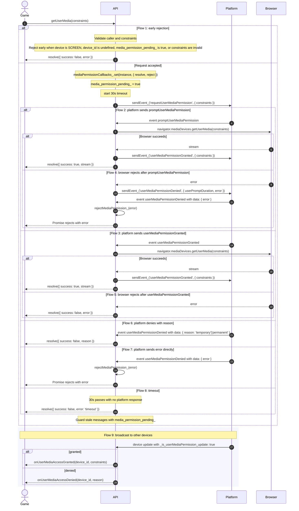

# Media Permission Flow

## Actors

**Game** calls `getUserMedia(constraints)` and consumes the returned Promise.

**API** is the AirConsole JS SDK running on the controller. It validates input, tracks pending state, talks to the platform, and bridges browser level failures back to the game.

**Platform** decides whether the permission flow should run through a browser prompt, resolve natively, deny with a reason, or return an error.

**Browser** is `navigator.mediaDevices.getUserMedia`, the final source of stream success or browser level failure.

## Sequence

## Key Design Decisions

Platform denials resolve the Promise with `{ success: false, ... }`. Browser failures use Promise rejection when the platform echoes a browser error back through `userMediaPermissionDenied`, but native controller browser failures after `userMediaPermissionGranted` resolve with `{ success: false, error }` instead.

Browser prompt failures use a platform echo pattern. The API sends `sendEvent_('userMediaPermissionDenied', { userPromptDuration, error })`, waits for the platform to echo `userMediaPermissionDenied` with `data: { error }`, then calls `rejectMediaPermission_(error)`.

Callback storage lives in a `WeakMap`, which keeps resolve and reject handlers attached to the SDK instance without exposing them on public state.

The 30 second timeout is a safety net. It resolves `{ success: false, error: 'timeout' }` if the platform never answers.

`media_permission_pending_` blocks duplicate requests and ignores stale platform messages after cleanup.
